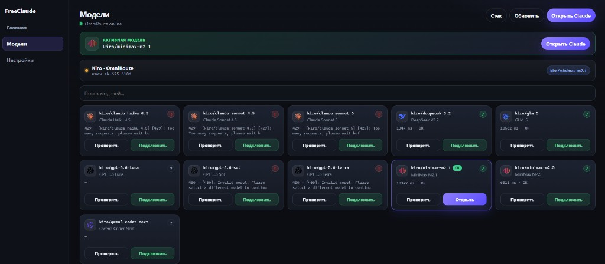

# FreeClaudeCode

Local Windows helper for **Claude Code** — install stack, sign in, pick a model, launch.



| | |
|:--|:--|
| **UI** | `http://127.0.0.1:3847` |
| **Router** | OmniRoute `http://127.0.0.1:20128` |
| **OS** | Windows 10 / 11 |
| **Runtime** | Node.js 22+ |

[Download ZIP](https://github.com/kolevans/FreeClaudeCode/releases/latest) · [Telegram](https://t.me/loveaideep) · [License](LICENSE)

---

## Why this exists

Claude Code is powerful, but setup is noisy: Node, OmniRoute, Kiro login, API keys, model switching. FreeClaudeCode wraps that into one local panel so you spend time coding, not configuring.

---

## What you get

- One-click install checks for Node / OmniRoute / Claude Code  
- Kiro (AWS Builder ID) device login + automatic key creation  
- Model grid with live status checks  
- Launch Claude Code against the active model  
- Portable Windows build for sharing the folder as-is  

---

## Install from release

1. Grab the latest asset from [Releases](https://github.com/kolevans/FreeClaudeCode/releases/latest)  
2. Unzip anywhere  
3. Start `FreeClaude.exe`  
4. Open the local UI and finish Settings → Kiro → Models  

> Tip: move the **whole** folder when copying to another PC.

---

## Run from source

```powershell
git clone https://github.com/kolevans/FreeClaudeCode.git
cd FreeClaudeCode
npm install
node server.js
```

Then open `http://127.0.0.1:3847`.

<details>
<summary>Optional manual stack</summary>

```powershell
winget install OpenJS.NodeJS.LTS
npm install -g omniroute @anthropic-ai/claude-code
omniroute
```

</details>

---

## Build portable EXE

```powershell
.\build-release.ps1
```

Artifacts land in `..\dist\FreeClaude\`.

---

## Repo map

| Path | Role |
|------|------|
| `server.js` | Local HTTP app, installer, Kiro flows |
| `omni-keys.js` | OmniRoute SQLite helpers |
| `public/` | Front-end |
| `build-release.ps1` | Packaging script |
| `assets/` | README media |

---

## Where data lives

- `%APPDATA%\FreeClaude\` — app config  
- `%USERPROFILE%\.omniroute\` — router DB / keys  
- `%USERPROFILE%\.claude\` — Claude Code profile  

Password override: `OMNIROUTE_PASSWORD` or `INITIAL_PASSWORD` (default `CHANGEME`).

---

## Flow

```text
Browser UI ──► FreeClaudeCode ──► OmniRoute
                     │
                     ├── Kiro / Builder ID
                     └── Claude Code CLI
```

Everything stays on your machine.

---

## Safety

Ship source only. Keep personal keys and `config.json` out of git.

---

## Changelog

See [CHANGELOG.md](CHANGELOG.md).

---

MIT © 2026 · contact [@loveaideep](https://t.me/loveaideep)
